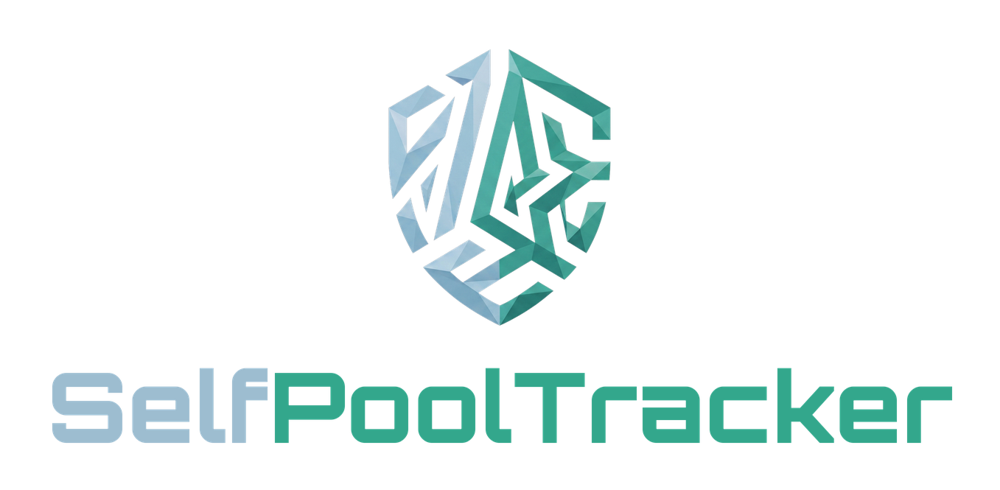

<div align="center">




**Pool water-quality tracker that runs entirely in your browser — pH, chlorine, redox & temperature logging with traffic-light status and dosing recommendations. No server, no cloud, no account.**

### 🌐 Live: **[pool.selfcoder.de](https://pool.selfcoder.de)**

[](https://pool.selfcoder.de)


[English](#english) · [Deutsch](#deutsch)

</div>

---

## English

SelfPoolTracker is a single-file web app for keeping your pool chemistry in check. Open one HTML file in Chrome or Edge, enter your pool dimensions, and log your measurements. Every value gets an automatic green / yellow / red status and a concrete dosing recommendation based on your pool volume. Data is stored locally — either in a JSON file on your own computer (File System Access API) or in the browser's `localStorage`. Nothing ever leaves your device.

### Features

- **Pool volume calculator** — Oval, Round and Rectangular pools with automatic shape-based labels
- **Daily measurement log** — pH, free chlorine, redox (mV), temperature, date & time
- **Automatic status** — green / yellow / red traffic light for every value
- **Dosing recommendations** — pH-Minus, pH-Plus and quick-chlorine amounts calculated from your pool volume
- **Dosing calculator** — standalone calculator for any manual adjustment, incl. shock chlorination
- **File-based storage** — data saved to a local JSON file (no cloud, no cache loss) with `localStorage` fallback
- **Backup & import** — export and re-import your full dataset (pool config + measurements) as a single JSON file; device-independent and works in any browser, including Android
- **CSV export** — export your full measurement history
- **DE / EN** — German and English UI, switchable at runtime
- **Self brand** — dark theme, teal accent, Exo 2 + IBM Plex Mono

### Usage

1. Open `index.html` in **Chrome** or **Edge** (the File System Access API is required for file storage)
2. Set your pool dimensions → volume is calculated automatically
3. Click **"📂 Datei öffnen / neu erstellen"** to link a data file on your computer
4. Enter measurements — data saves automatically after each entry

> Firefox does not support the File System Access API. There it falls back to `localStorage`, so use Chrome or Edge for file-based storage.

### Data storage

Everything stays on your device — there is no server, no account and no network call. Concretely, the app uses three local mechanisms:

- **`localStorage`** (key `selfpooltracker_v1`) — your pool config and measurements are auto-saved here after every change.
- **IndexedDB** (database `selfpool_db`) — stores the `FileSystemFileHandle` so a linked data file can be re-opened automatically on the next visit (Chrome/Edge only).
- **Local JSON file** (optional, File System Access API) — your data file on disk.

All data is stored **in plain text** — it is not encrypted. The stored values (pool dimensions, pH, chlorine, redox, temperature) are not sensitive, but be aware that **clearing your browser cache / site data will erase the `localStorage` and IndexedDB copy.** To keep your history safe across cache clears, browsers or devices, link a **data file** (Chrome/Edge) or use **💾 Backup** to export a JSON file and **📥 Import** it later.

> **Android app (SelfStore):** the WebView build exposes a native bridge (`window.SelfPoolAndroid`) so **CSV** and **JSON backup** exports are written straight to the device file system, since the File System Access API is not available there.

### Ideal values

| Parameter | Min | Ideal | Max | Unit |
|-----------|-----|-------|-----|------|
| pH | 7.2 | 7.2 – 7.6 | 7.6 | – |
| Free chlorine | 0.5 | 0.5 – 1.5 | 1.5 | mg/l |
| Redox / MV | 650 | 650 – 750 | 750 | mV |
| Temperature | 15 | 20 – 28 | 35 | °C |

---

## Deutsch

SelfPoolTracker ist eine Single-File-Webapp, mit der du deine Poolwerte im Griff behältst. Eine HTML-Datei in Chrome oder Edge öffnen, Pool-Maße eintragen und Messwerte loggen. Jeder Wert bekommt automatisch einen grün / gelb / rot-Status und eine konkrete Dosierempfehlung anhand deines Pool-Volumens. Die Daten liegen lokal — entweder in einer JSON-Datei auf deinem Rechner (File System Access API) oder im `localStorage` des Browsers. Es verlässt nichts dein Gerät.

### Funktionen

- **Pool-Volumenrechner** — Oval, Rund und Rechteckig mit automatischen, formabhängigen Bezeichnungen
- **Tägliches Mess-Log** — pH, freies Chlor, Redox (mV), Temperatur, Datum & Uhrzeit
- **Automatischer Status** — grün / gelb / rot-Ampel für jeden Wert
- **Dosierempfehlungen** — pH-Minus, pH-Plus und Schnellchlor-Mengen aus dem Pool-Volumen berechnet
- **Dosierungsrechner** — eigenständiger Rechner für jede manuelle Anpassung, inkl. Schockchlorung
- **Dateibasierte Speicherung** — Daten in einer lokalen JSON-Datei (keine Cloud, kein Cache-Verlust) mit `localStorage`-Fallback
- **Backup & Import** — kompletter Datenbestand (Pool-Konfig + Messwerte) als einzelne JSON-Datei exportieren und wieder einlesen; geräteunabhängig, in jedem Browser und auf Android
- **CSV-Export** — kompletter Messverlauf als CSV
- **DE / EN** — deutsche und englische Oberfläche, zur Laufzeit umschaltbar
- **Self-Brand** — Dark-Theme, Teal-Akzent, Exo 2 + IBM Plex Mono

### Benutzung

1. `index.html` in **Chrome** oder **Edge** öffnen (File System Access API für Datei-Speicherung nötig)
2. Pool-Maße setzen → Volumen wird automatisch berechnet
3. Auf **"📂 Datei öffnen / neu erstellen"** klicken, um eine Datendatei auf dem Rechner zu verknüpfen
4. Messwerte eintragen — speichert nach jedem Eintrag automatisch

> Firefox unterstützt die File System Access API nicht. Dort greift der `localStorage`-Fallback — für Datei-Speicherung Chrome oder Edge nutzen.

### Datenspeicherung

Alles bleibt auf deinem Gerät — kein Server, kein Konto, kein Netzwerk-Aufruf. Konkret nutzt die App drei lokale Mechanismen:

- **`localStorage`** (Key `selfpooltracker_v1`) — Pool-Konfig und Messwerte werden hier nach jeder Änderung automatisch gesichert.
- **IndexedDB** (Datenbank `selfpool_db`) — speichert den `FileSystemFileHandle`, damit eine verknüpfte Datendatei beim nächsten Besuch automatisch wieder geöffnet werden kann (nur Chrome/Edge).
- **Lokale JSON-Datei** (optional, File System Access API) — deine Datendatei auf der Festplatte.

Alle Daten werden **im Klartext** gespeichert — sie sind nicht verschlüsselt. Die gespeicherten Werte (Pool-Maße, pH, Chlor, Redox, Temperatur) sind nicht sensibel, aber beachte: **Wird der Browser-Cache / die Website-Daten geleert, sind die Kopie in `localStorage` und IndexedDB weg.** Damit der Verlauf Cache-Leerungen, Browser- oder Gerätewechsel übersteht, eine **Datendatei** verknüpfen (Chrome/Edge) oder per **💾 Backup** eine JSON-Datei exportieren und später per **📥 Import** wieder einlesen.

> **Android-App (SelfStore):** Der WebView-Build stellt eine native Bridge (`window.SelfPoolAndroid`) bereit, sodass **CSV-** und **JSON-Backup-**Exporte direkt ins Dateisystem des Geräts geschrieben werden — die File System Access API ist dort nicht verfügbar.

---

## Project structure

```
selfpooltracker/
├── index.html        # Single-file app (UI + logic + i18n)
├── assets/
│   └── logo.png      # Branded SelfPoolTracker wordmark
├── logo/
│   └── shield.png    # Self shield emblem (in-app header)
├── LICENSE           # MIT license
└── README.md
```

## Brand

Uses the **Self Design System** — tokens, fonts and shield from [`brand-kit`](../brand-kit/).

- Colors: `--self-teal` `#33a78c` · `--self-bg-0` `#080c11`
- Fonts: Exo 2 · IBM Plex Mono

## License

MIT © Self Projects
